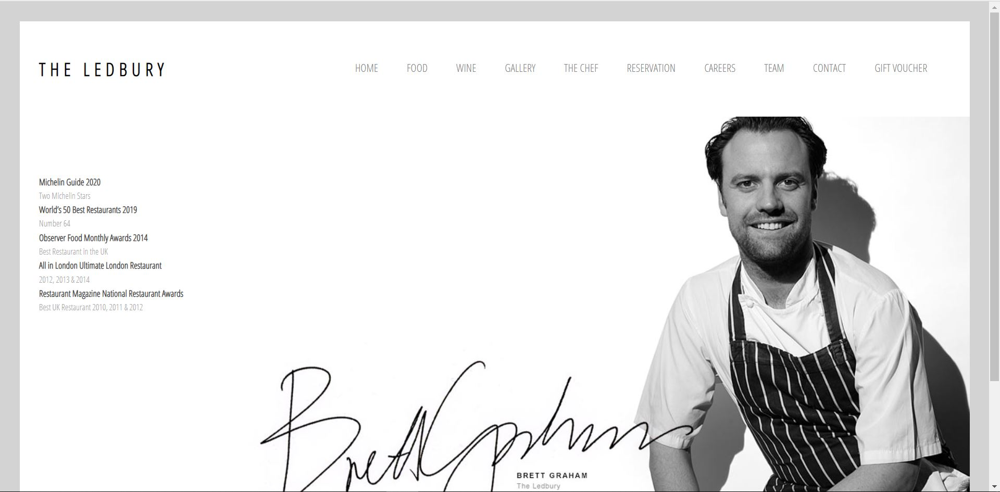
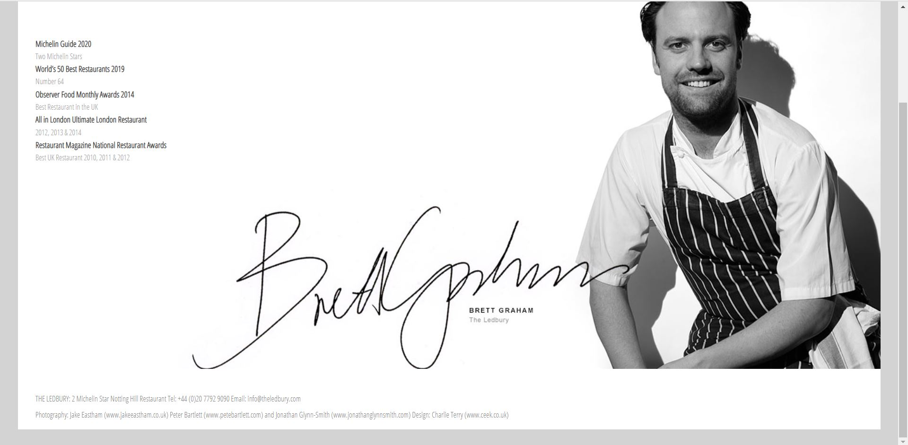

# The_ledbury

This website formed on the official site of The Ledbury (A Restaurant in the UK) on tutorial purposes.
This website designed with only HTML & CSS. This will be helpful for those who prefer to try out to create some projects to practice.

Things you can learn from this project-

* CSS Positioning.
* CSS display.
* How to make dropdown.
* How to make dropdown(Sub-menu) visible on hover.
* Use of relative and Absolute positioning.
* How to make Navigation list.
* Linking google fonts.
* CSS Normalization.
* CSS Nesting.
* How use of div is better than use of body for main section.

